  

 

 

<table>
<tr>
<td width="130" align="center" valign="top">
  
</td>
<td valign="top">

### `~/a-propos`

Je construis la partie du produit que personne ne voit et dont tout le monde dépend.

Services backend, APIs, et l'automatisation qui supprime le travail qu'on ne devrait pas faire deux fois. Mon terrain par défaut : **Node.js** - rapide à prendre en main, honnête sur ses compromis, et assez proche de la machine pour rester intéressant.

Ce à quoi je tiens : du code qui se lit comme s'il était évident, des systèmes qui échouent bruyamment plutôt qu'en silence, et livrer quelque chose de réel plutôt que polir quelque chose d'imaginaire.

En ce moment j'affûte : l'architecture, la performance, et les parties du métier qui ne s'améliorent qu'à force de répétition.

</td>
</tr>
</table>

 

 

## `~/stack`

 

  

<table>
<tr>
<td align="center" width="33%">

**RUNTIME**

 
 

</td>
<td align="center" width="33%">

**BACKEND**

 
 

</td>
<td align="center" width="33%">

**ENVIRONNEMENT**

 
 

</td>
</tr>
</table>

 

 

## `~/cat profile.js`

 

  

 

## `~/stats`

 

  

 

 

## `~/contact`

 

 

  

